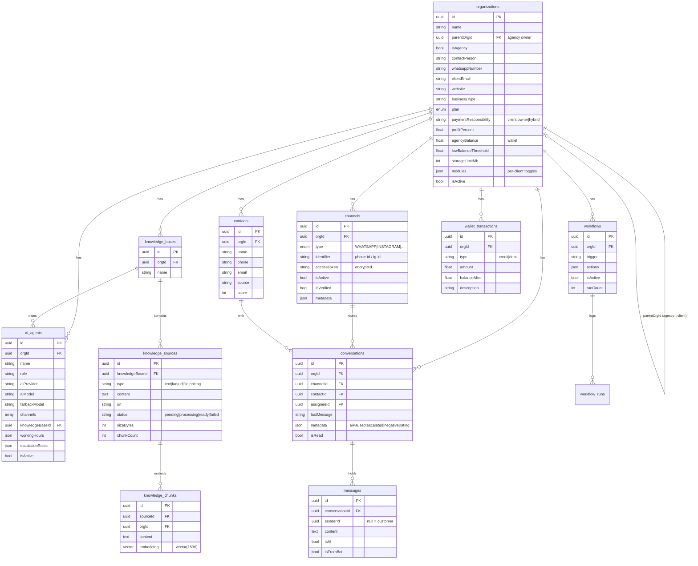

# Client Data Model — Hayya AI

A **client** = one row in `organizations` (a child org under your agency, via `parentOrgId`).
Everything else belongs to that client through **`orgId`** and is isolated.

---

## ER Diagram (Mermaid — renders on GitHub / mermaid.live)



---

## Raw SQL (PostgreSQL — abridged to the client-relevant columns)

```sql
-- ╔══════════════════════════════════════════════════════════════╗
-- ║  THE CLIENT  (a child org under your agency)                  ║
-- ╚══════════════════════════════════════════════════════════════╝
CREATE TABLE "organizations" (
  "id"                    TEXT PRIMARY KEY DEFAULT gen_random_uuid(),
  "name"                  TEXT NOT NULL,
  "slug"                  TEXT UNIQUE NOT NULL,
  "logo"                  TEXT,
  "parentOrgId"           TEXT REFERENCES "organizations"("id"),  -- agency → client
  "isAgency"              BOOLEAN NOT NULL DEFAULT false,
  "isActive"              BOOLEAN NOT NULL DEFAULT true,
  -- profile
  "industry"              TEXT,
  "businessType"          TEXT,
  "contactPerson"         TEXT,
  "whatsappNumber"        TEXT,
  "clientEmail"           TEXT,
  "website"               TEXT,
  "country"               TEXT NOT NULL DEFAULT 'QA',
  "timezone"              TEXT NOT NULL DEFAULT 'Asia/Qatar',
  "currency"              TEXT NOT NULL DEFAULT 'QAR',
  "plan"                  TEXT NOT NULL DEFAULT 'STARTER',
  -- billing / profit / wallet
  "paymentResponsibility" TEXT NOT NULL DEFAULT 'client',   -- client|owner|hybrid
  "profitPercent"         DOUBLE PRECISION NOT NULL DEFAULT 0,
  "agencyBalance"         DOUBLE PRECISION NOT NULL DEFAULT 0,
  "lowBalanceThreshold"   DOUBLE PRECISION NOT NULL DEFAULT 50,
  "agencyStatus"          TEXT NOT NULL DEFAULT 'good',
  "campaignBilling"       TEXT NOT NULL DEFAULT '',
  -- storage / modules / notes
  "storageLimitMb"        INTEGER NOT NULL DEFAULT 500,
  "modules"               JSONB,                            -- per-client feature toggles
  "adminNotes"            TEXT NOT NULL DEFAULT '',
  "agencyNotes"           TEXT NOT NULL DEFAULT '',
  "createdAt"             TIMESTAMP(3) NOT NULL DEFAULT now(),
  "updatedAt"             TIMESTAMP(3) NOT NULL
);

-- ╔══════════════════════════════════════════════════════════════╗
-- ║  CHANNELS  (WhatsApp / Instagram / website / telegram)        ║
-- ╚══════════════════════════════════════════════════════════════╝
CREATE TABLE "channels" (
  "id"            TEXT PRIMARY KEY DEFAULT gen_random_uuid(),
  "orgId"         TEXT NOT NULL REFERENCES "organizations"("id"),
  "type"          TEXT NOT NULL,        -- WHATSAPP | INSTAGRAM | TELEGRAM | LIVE_CHAT …
  "name"          TEXT NOT NULL,
  "identifier"    TEXT NOT NULL,        -- phone-number-id / ig-account-id / username
  "accessToken"   TEXT,                 -- AES-256-GCM encrypted
  "webhookSecret" TEXT,
  "isActive"      BOOLEAN NOT NULL DEFAULT true,
  "isVerified"    BOOLEAN NOT NULL DEFAULT false,
  "metadata"      JSONB,                -- { provider, username, … }
  "createdAt"     TIMESTAMP(3) NOT NULL DEFAULT now(),
  "updatedAt"     TIMESTAMP(3) NOT NULL
);

-- ╔══════════════════════════════════════════════════════════════╗
-- ║  AI BRAIN  (knowledge_bases → sources → vector chunks)        ║
-- ╚══════════════════════════════════════════════════════════════╝
CREATE TABLE "knowledge_bases" (
  "id"          TEXT PRIMARY KEY DEFAULT gen_random_uuid(),
  "orgId"       TEXT NOT NULL REFERENCES "organizations"("id"),
  "name"        TEXT NOT NULL,
  "description" TEXT,
  "createdAt"   TIMESTAMP(3) NOT NULL DEFAULT now(),
  "updatedAt"   TIMESTAMP(3) NOT NULL
);

CREATE TABLE "knowledge_sources" (
  "id"              TEXT PRIMARY KEY DEFAULT gen_random_uuid(),
  "knowledgeBaseId" TEXT NOT NULL REFERENCES "knowledge_bases"("id"),
  "type"            TEXT NOT NULL,      -- text | faq | url | file | pricing | product_list
  "name"            TEXT NOT NULL,
  "content"         TEXT,
  "url"             TEXT,
  "filePath"        TEXT,
  "status"          TEXT NOT NULL DEFAULT 'pending',  -- pending|processing|ready|failed
  "chunkCount"      INTEGER NOT NULL DEFAULT 0,
  "sizeBytes"       INTEGER NOT NULL DEFAULT 0,
  "lastIndexed"     TIMESTAMP(3),
  "metadata"        JSONB,
  "createdAt"       TIMESTAMP(3) NOT NULL DEFAULT now(),
  "updatedAt"       TIMESTAMP(3) NOT NULL
);

CREATE TABLE "knowledge_chunks" (
  "id"              TEXT PRIMARY KEY DEFAULT gen_random_uuid(),
  "sourceId"        TEXT NOT NULL REFERENCES "knowledge_sources"("id") ON DELETE CASCADE,
  "knowledgeBaseId" TEXT NOT NULL,
  "orgId"           TEXT NOT NULL,
  "content"         TEXT NOT NULL,
  "embedding"       vector(1536),       -- pgvector
  "chunkIndex"      INTEGER NOT NULL DEFAULT 0,
  "createdAt"       TIMESTAMP(3) NOT NULL DEFAULT now()
);

-- ╔══════════════════════════════════════════════════════════════╗
-- ║  AI AGENTS                                                    ║
-- ╚══════════════════════════════════════════════════════════════╝
CREATE TABLE "ai_agents" (
  "id"              TEXT PRIMARY KEY DEFAULT gen_random_uuid(),
  "orgId"           TEXT NOT NULL REFERENCES "organizations"("id"),
  "name"            TEXT NOT NULL,
  "role"            TEXT NOT NULL DEFAULT 'receptionist',
  "aiProvider"      TEXT NOT NULL DEFAULT 'openai',
  "aiModel"         TEXT NOT NULL DEFAULT 'gpt-4o',
  "fallbackModel"   TEXT,
  "channels"        TEXT[],
  "knowledgeBaseId" TEXT REFERENCES "knowledge_bases"("id"),
  "workingHours"    JSONB,
  "escalationRules" JSONB,
  "isActive"        BOOLEAN NOT NULL DEFAULT false,
  "createdAt"       TIMESTAMP(3) NOT NULL DEFAULT now(),
  "updatedAt"       TIMESTAMP(3) NOT NULL
);

-- ╔══════════════════════════════════════════════════════════════╗
-- ║  AUTOMATIONS (workflows + run logs)                          ║
-- ╚══════════════════════════════════════════════════════════════╝
CREATE TABLE "workflows" (
  "id"         TEXT PRIMARY KEY DEFAULT gen_random_uuid(),
  "orgId"      TEXT NOT NULL REFERENCES "organizations"("id"),
  "name"       TEXT NOT NULL,
  "trigger"    TEXT NOT NULL,          -- new_contact | keyword | tag_added | status_changed
  "conditions" JSONB,
  "actions"    JSONB NOT NULL,         -- ordered steps
  "isActive"   BOOLEAN NOT NULL DEFAULT true,
  "runCount"   INTEGER NOT NULL DEFAULT 0,
  "createdAt"  TIMESTAMP(3) NOT NULL DEFAULT now(),
  "updatedAt"  TIMESTAMP(3) NOT NULL
);

CREATE TABLE "workflow_runs" (
  "id"          TEXT PRIMARY KEY DEFAULT gen_random_uuid(),
  "orgId"       TEXT NOT NULL,
  "workflowId"  TEXT NOT NULL REFERENCES "workflows"("id"),
  "contactId"   TEXT,
  "status"      TEXT NOT NULL DEFAULT 'running',
  "currentStep" INTEGER NOT NULL DEFAULT 0,
  "nextStepAt"  TIMESTAMP(3),          -- for time-delayed (wait) steps
  "error"       TEXT,
  "createdAt"   TIMESTAMP(3) NOT NULL DEFAULT now()
);

-- ╔══════════════════════════════════════════════════════════════╗
-- ║  CUSTOMERS + CHATS                                           ║
-- ╚══════════════════════════════════════════════════════════════╝
CREATE TABLE "contacts" (
  "id"        TEXT PRIMARY KEY DEFAULT gen_random_uuid(),
  "orgId"     TEXT NOT NULL REFERENCES "organizations"("id"),
  "name"      TEXT,
  "phone"     TEXT,
  "email"     TEXT,
  "source"    TEXT,                    -- whatsapp | instagram | website | …
  "status"    TEXT,
  "score"     INTEGER NOT NULL DEFAULT 0,
  "metadata"  JSONB,
  "createdAt" TIMESTAMP(3) NOT NULL DEFAULT now(),
  "updatedAt" TIMESTAMP(3) NOT NULL
);

CREATE TABLE "conversations" (
  "id"          TEXT PRIMARY KEY DEFAULT gen_random_uuid(),
  "orgId"       TEXT NOT NULL REFERENCES "organizations"("id"),
  "channelId"   TEXT REFERENCES "channels"("id"),
  "contactId"   TEXT REFERENCES "contacts"("id"),
  "assigneeId"  TEXT,                  -- team member handling it
  "status"      TEXT NOT NULL DEFAULT 'OPEN',
  "externalId"  TEXT,                  -- the channel's conversation id
  "lastMessage" TEXT,
  "lastMsgAt"   TIMESTAMP(3),
  "isRead"      BOOLEAN NOT NULL DEFAULT false,
  "metadata"    JSONB,                 -- { aiPaused, escalated, negative, rating }
  "createdAt"   TIMESTAMP(3) NOT NULL DEFAULT now(),
  "updatedAt"   TIMESTAMP(3) NOT NULL
);

CREATE TABLE "messages" (
  "id"             TEXT PRIMARY KEY DEFAULT gen_random_uuid(),
  "conversationId" TEXT NOT NULL REFERENCES "conversations"("id"),
  "senderId"       TEXT,              -- NULL = customer; set = team member
  "type"           TEXT NOT NULL DEFAULT 'TEXT',
  "content"        TEXT,
  "isAI"           BOOLEAN NOT NULL DEFAULT false,   -- AI-generated reply
  "isFromBot"      BOOLEAN NOT NULL DEFAULT false,
  "externalId"     TEXT,
  "createdAt"      TIMESTAMP(3) NOT NULL DEFAULT now()
);

-- ╔══════════════════════════════════════════════════════════════╗
-- ║  WALLET LEDGER (per-client money)                            ║
-- ╚══════════════════════════════════════════════════════════════╝
CREATE TABLE "wallet_transactions" (
  "id"           TEXT PRIMARY KEY DEFAULT gen_random_uuid(),
  "orgId"        TEXT NOT NULL,        -- the client org
  "type"         TEXT NOT NULL,        -- credit (top-up) | debit (campaign/usage)
  "amount"       DOUBLE PRECISION NOT NULL,
  "description"  TEXT NOT NULL DEFAULT '',
  "balanceAfter" DOUBLE PRECISION NOT NULL DEFAULT 0,
  "metadata"     JSONB,
  "createdAt"    TIMESTAMP(3) NOT NULL DEFAULT now()
);

-- Isolation: every child table carries orgId = the client's org id.
-- The agency reaches a client only via parentOrgId + an assertOwns() check.
CREATE INDEX ON "channels"("orgId");
CREATE INDEX ON "knowledge_bases"("orgId");
CREATE INDEX ON "ai_agents"("orgId");
CREATE INDEX ON "workflows"("orgId");
CREATE INDEX ON "contacts"("orgId");
CREATE INDEX ON "conversations"("orgId");
CREATE INDEX ON "wallet_transactions"("orgId");
```
